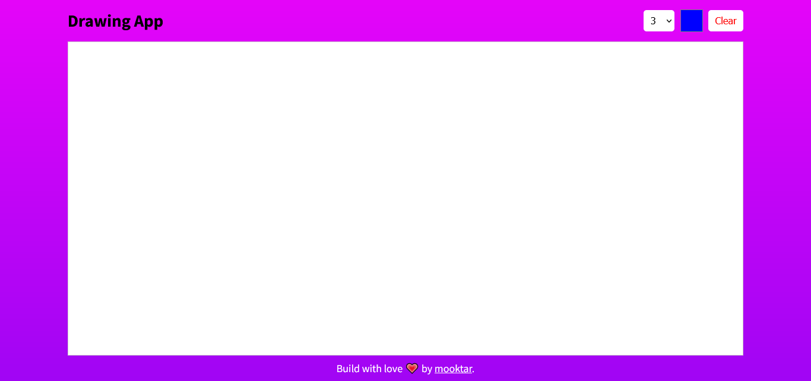

# Drawing App


## Table of contents

- [Overview](#overview)
- [Screenshot](#screenshot)
- [Links](#links)
- [Built with](#built-with)
- [Useful resources](#useful-resources)
- [Author](#author)


## Overview

An app to drawing cool 2D design and notes.
Users should be able to:

- draw anythings he wants
- set size of lines
- pick a color to fill that lines
- erase all the drawed lines


## Screenshot




## Links

- Solution URL: [here](https://github.com/mooktar/drawing-app)


## Built with

- Semantic HTML5 markup
- Flexbox
- Mobile-first workflow
- SVG elements


### What I learned

In this project i've discovered how to use svg elements to join make point and joins it to make line depending of size and color to fill theses points.


## Useful resources

- [D3.js](https://www.d3js.org) - D3 is a javascript library for manipulating documents based on data.
- [D3 v7 script link](https://d3js.org/d3.v7.min.js) - ```<script src="https://d3js.org/d3.v7.min.js"></script>```


## Author

- Github - [mooktar](https://github.com/mooktar)
- Twitter - [@mooktar_dev](https://www.twitter.com/mooktar_dev)
